<div align="center">

<h3><code>varshith@github ~ $ ./contributions.sh</code></h3>



<br><br>

<h3><code>varshith@github ~ $ whoami</code></h3>

<table>
<tr>
<td valign="top"></td>
<td valign="top"></td>
</tr>
</table>

<br>

<code>varshith@github ~ $ cat README.md</code>

</div>

---

## 🧠 About

I'm **Thalla Varshith**, a B.Tech Mechatronics Engineer building toward **AI/ML Engineering, Applied AI, Computer Vision, and Robotics + AI**.

My work sits at the intersection of:

`MECHATRONICS` → `SOFTWARE` → `DATA` → `AI` → `INTELLIGENT SYSTEMS`

### Current Focus

- 🤖 Machine Learning & Deep Learning
- 👁️ Computer Vision
- 🧠 LLM Engineering, Transformers & RAG
- 🦾 Robotics and intelligent automation
- ⚙️ SolidWorks, 3D printing & rapid prototyping
- 💻 Python, PyTorch, TensorFlow, OpenCV and AI engineering tools

---

## 🛠️ Tech Stack

<p align="center">

</p>

<p align="center">


</p>

---

## 🚀 Projects

### `01` — AI / ML & Computer Vision

**Human Face Detection**  
Real-time face detection using OpenCV's DNN module and pretrained TensorFlow models.

→ [Repository](https://github.com/Varshith-2603/emotion-detector)

### `02` — AI/ML Engineering Practice

**AI/ML Engineering Tasks**  
Structured practice covering Python, mathematics, DSA, SQL, machine learning, deep learning and AI engineering.

→ [Repository](https://github.com/Varshith-2603/ai-ml-engineering-tasks)

### `03` — Robotics & Embedded Systems

**Bluetooth-Controlled Car**  
Arduino + L298N motor driver + Bluetooth control + hardware troubleshooting.

**Robotic Arm Design**  
SolidWorks modelling, assembly and kinematic analysis — *in progress*.

### `04` — Mechanical Design & Rapid Prototyping

**Gear Pump Design & Working Model**  
3D modelling, FDM printing with PLA, dimensional validation and prototype assembly.

---

## 🧪 Engineering Experience

**Lohitha Power Products — Electrical Engineering Intern**  
*Hyderabad · Jun 2024 – Jul 2024*

- Servo-controlled voltage stabilizers
- Air-cooled and ultra-isolation transformers
- MCBs and power-quality concepts
- Industrial safety and electrical systems

---

## 🎓 Certifications

- 3D Printing Machine — Understanding & Operation
- Drone Technology — Parts Dismantling & Assembly
- Rapid Prototyping Using Laser Scanning Technology

---

## 📊 Profile Activity

The contribution visualization above is **generated locally as SVG from GitHub's public contribution calendar**. It does not use GitHub-readme-stats, streak services, a GitHub personal access token, JavaScript, or an external statistics dashboard.

### Profile Art Pipeline

`avi-ascii.svg`  
→ monochrome self-typing ASCII portrait

`info-card.svg`  
→ animated neofetch-style identity / stack card

`contrib-heatmap.svg`  
→ 53-week contribution calendar with animated reveal

`.github/workflows/update-profile-art.yml`  
→ refreshes contribution data automatically every day

---

## 💻 Local Portrait Setup

The repository includes the complete portrait pipeline.

1. Put your preferred profile photo in the repository root as `source-photo.jpg`.
2. Install the portrait dependencies:
   ```bash
   pip install -r scripts/requirements.txt
   ```
3. Prepare the image:
   ```bash
   python scripts/prep_photo.py source-photo.jpg
   ```
4. Generate the animated ASCII SVG:
   ```bash
   python scripts/make_ascii_svg.py
   ```
5. Commit the new `avi-ascii.svg`.

The source photo and intermediate image are ignored by Git so they do not become part of the public repository.

---

<div align="center">

<code>varshith@github ~ $ echo "MECHATRONICS → AI → INTELLIGENT SYSTEMS"</code>

<br><br>

<a href="https://www.linkedin.com/in/thalla-varshith-0aa11b258/">LinkedIn</a>
&nbsp;•&nbsp;
<a href="mailto:varshith.thalla@gmail.com">Email</a>
&nbsp;•&nbsp;
<a href="https://github.com/Varshith-2603">GitHub</a>

<br><br>


</div>
