# Hi there 👋, I'm Varshith

### AI/ML Engineer | Computer Vision | Robotics

**B.Tech Mechatronics Engineer** focused on building practical AI systems, machine learning applications and intelligent engineering solutions.

---

<table>
<tr>
<td width="30%" align="center" valign="top">

### Thalla Varshith

**AI/ML Engineer**  
Computer Vision · Robotics  
Mechatronics Engineering

India

[LinkedIn](https://www.linkedin.com/in/thalla-varshith-0aa11b258/)  
[Email](mailto:varshith.thalla@gmail.com)

</td>

<td width="70%" valign="top">

## About Me

- 🖥️ Building **AI/ML applications and computer vision systems**
- 🤖 Combining **AI with robotics and mechatronics**
- 🧠 Learning **machine learning, deep learning, LLMs and RAG**
- ⚙️ Interested in **AI engineering, ML systems and deployment**
- 🔧 Background in **CAD, embedded systems and rapid prototyping**
- 📚 Currently strengthening **DSA, ML fundamentals and software engineering**

I enjoy taking a problem from **idea → implementation → evaluation → usable application**.

</td>
</tr>
</table>

---

## 🛠️ Tech Stack

<table>
<tr>
<td><b>Languages & Data</b></td>
<td>Python · SQL · NumPy · Pandas</td>
</tr>
<tr>
<td><b>AI / ML</b></td>
<td>PyTorch · TensorFlow · Keras · Scikit-learn</td>
</tr>
<tr>
<td><b>Computer Vision</b></td>
<td>OpenCV · Image Processing · Deep Learning</td>
</tr>
<tr>
<td><b>Backend & Apps</b></td>
<td>FastAPI · Streamlit</td>
</tr>
<tr>
<td><b>Robotics & Engineering</b></td>
<td>Arduino · SolidWorks · 3D Printing · Rapid Prototyping</td>
</tr>
<tr>
<td><b>Developer Tools</b></td>
<td>Git · GitHub · VS Code · Google Colab</td>
</tr>
</table>

---

## 🚀 Featured Projects

<table>
<tr>
<td width="50%" valign="top">

### Human Face & Emotion Detection

**Python · OpenCV · TensorFlow/Keras**

Computer vision project for face detection and facial-expression classification with real-time image processing.

[View repository →](https://github.com/Varshith-2603/emotion-detector)

</td>

<td width="50%" valign="top">

### AI/ML Engineering Tasks

**Python · ML · Deep Learning · Mathematics**

Structured workspace for developing Python, mathematical, machine learning and AI engineering foundations.

[View repository →](https://github.com/Varshith-2603/ai-ml-engineering-tasks)

</td>
</tr>

<tr>
<td width="50%" valign="top">

### Bluetooth-Controlled Car

**Arduino · Embedded Systems · Bluetooth**

Arduino-based mobile robot integrating Bluetooth control, motor driving and hardware components.

</td>

<td width="50%" valign="top">

### Robotic Arm Design

**SolidWorks · Robotics · Motion Analysis**

Robotic arm modelling and assembly work developed as part of my robotics engineering track.

</td>
</tr>

<tr>
<td width="50%" valign="top">

### Gear Pump Design & Prototype

**CAD · 3D Printing · PLA**

Designed a working gear-pump model and developed a physical prototype using FDM 3D printing.

</td>

<td width="50%" valign="top">

### Engineering + AI

**Mechatronics · AI · Automation**

Exploring applications where software, machine learning, embedded systems and physical engineering work together.

</td>
</tr>
</table>

---

## 📊 GitHub Overview

<table>
<tr>
<td width="50%" valign="top">

### GitHub Stats

</td>

<td width="50%" valign="top">

### Contribution Activity

</td>
</tr>
</table>

---

## 💼 Engineering Experience

### Lohitha Power Products — Electrical Engineering Intern

**Hyderabad**

Worked with electrical power equipment and developed practical exposure to:

- Servo-controlled voltage stabilizers
- Air-cooled transformers
- Ultra-isolation transformers
- Electrical loads and power factor
- MCBs and power-quality fundamentals

This experience connected electrical engineering theory with practical industrial equipment and systems.

---

## 🎓 Education

**B.Tech — Mechatronics Engineering**  
ICFAI Tech School, Hyderabad

**Core areas:** Mechatronics · Robotics · Electronics · Control Systems · Programming · AI/ML

---

## 🏆 Certifications & Practical Training

- **3D Printing Machine** — Understanding & Operation
- **Drone Technology** — Parts Dismantling & Assembly
- **Rapid Prototyping** — Laser Scanning Technology

---

## 📌 Current Focus

<table>
<tr>
<td align="center">DSA</td>
<td>→</td>
<td align="center">Machine Learning</td>
<td>→</td>
<td align="center">Deep Learning</td>
<td>→</td>
<td align="center">AI Engineering</td>
</tr>
<tr>
<td colspan="7" align="center">Computer Vision · LLMs · RAG · Deployment · ML Systems</td>
</tr>
</table>

---

## 🤝 Connect

# 💫 About Me:
🖥️ Building AI/ML applications and computer vision systems 🤖 Combining AI with robotics and mechatronics 🧠 Learning machine learning, deep learning, LLMs and RAG ⚙️ Interested in AI engineering, ML systems and deployment 🔧 Background in CAD, embedded systems and rapid prototyping 📚 Currently strengthening DSA, ML fundamentals and software engineering I enjoy taking a problem from idea → implementation → evaluation → usable application.

## 🌐 Socials:
   
# 📊 GitHub Stats:
 
 

## 🏆 GitHub Trophies

### ✍️ Random Dev Quote

### 🔝 Top Contributed Repo

---

<!-- Proudly created with GPRM ( https://gprm.itsvg.in ) -->

 

Building practical systems at the intersection of AI, software and engineering.

