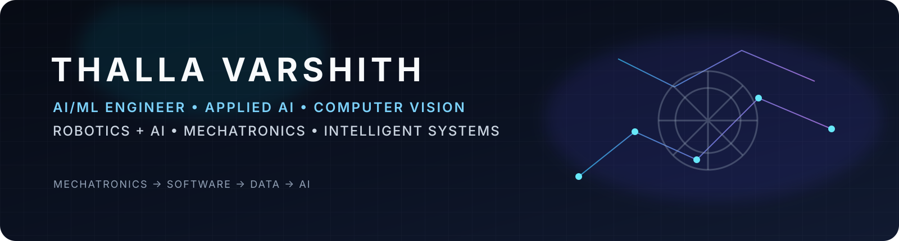
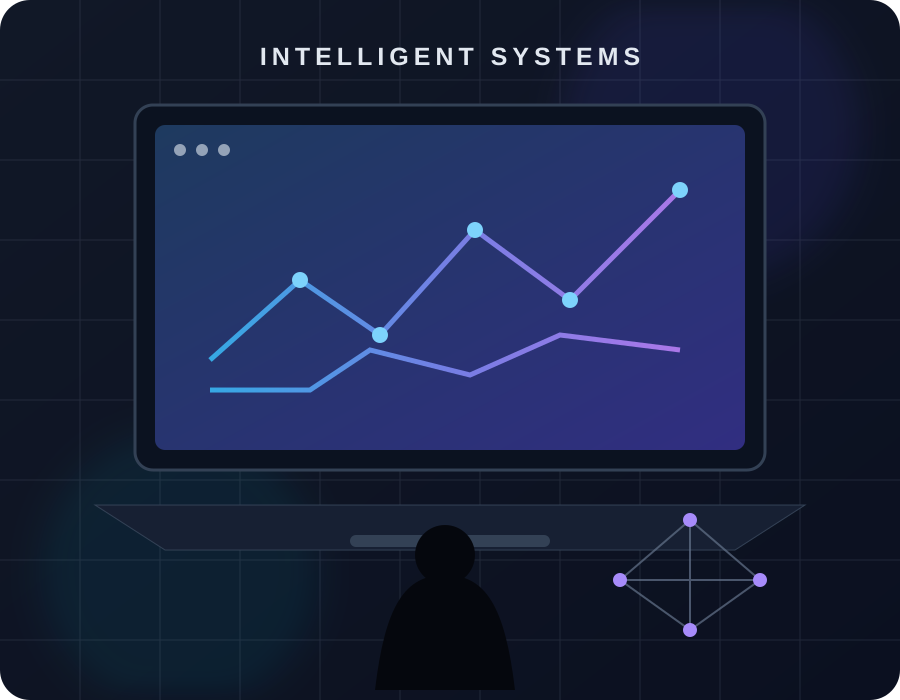

<div align="center">



</div>

## 🔗 About Me

<table>
<tr>
<td width="55%" valign="top">

```python
varshith = {
    "role": "AI/ML Engineer",
    "background": "B.Tech Mechatronics",
    "location": "India 🇮🇳",

    "building": [
        "AI / ML Systems",
        "Computer Vision",
        "Robotics + AI",
        "Intelligent Automation"
    ],

    "learning": [
        "Machine Learning",
        "Deep Learning",
        "LLM Engineering",
        "ML Systems"
    ],

    "engineering": [
        "SolidWorks",
        "Rapid Prototyping",
        "Embedded Systems",
        "3D Printing"
    ]
}
```

</td>
<td width="45%" valign="middle" align="center">



</td>
</tr>
</table>

> *Building intelligent systems where software, data, AI and physical engineering meet.*

---

## 💬 Engineering Philosophy

> **Learn deeply. Build practically. Test relentlessly. Improve continuously.**

---

## 🤝 Connect With Me

<p align="center">
<a href="https://www.linkedin.com/in/thalla-varshith-0aa11b258/"></a>
<a href="mailto:varshith.thalla@gmail.com"></a>
<a href="https://github.com/Varshith-2603"></a>
</p>

---

## 🛠️ Tech Stack

### 🤖 AI / Machine Learning

<p>

</p>

### 📊 Data Science

<p>


</p>

### 👁️ Computer Vision

<p>


</p>

### 🧠 AI / LLM Engineering — Learning

<p>


</p>

### 💻 Software & Engineering Tools

<p>


</p>

### 🤖 Robotics & Mechatronics

<p>


</p>

> **Note:** Java and C are intentionally excluded from the displayed profile stack.

---

## 🚀 Project Domains

<table>
<tr>
<td width="50%" valign="top">

### 🤖 AI / ML & Computer Vision

**Human Face Detection**  
OpenCV DNN + pretrained TensorFlow models + real-time camera inference.

**AI/ML Engineering Tasks**  
Structured practice across Python, mathematics, DSA, SQL, ML and AI engineering.

</td>
<td width="50%" valign="top">

### 🦾 Robotics & Embedded

**Bluetooth-Controlled Car**  
Arduino + L298N motor driver + Bluetooth + hardware troubleshooting.

**Robotic Arm Design**  
SolidWorks modelling, assembly and kinematic analysis *(in progress)*.

</td>
</tr>
<tr>
<td width="50%" valign="top">

### ⚙️ Mechanical Design

**Gear Pump Design & Working Model**  
3D modelling, FDM printing with PLA, dimensional validation and prototype assembly.

</td>
<td width="50%" valign="top">

### 🔬 Engineering Direction

AI × Data × Vision × Robotics  
Mechatronics → Software → Intelligent Systems

</td>
</tr>
</table>

---

## 📊 GitHub Analytics

<p align="center">


</p>

<p align="center">

</p>

---

## 📈 Contribution Activity

<p align="center">

</p>

---

## 🏆 GitHub Trophies

<p align="center">

</p>

---

## 🎓 Experience & Certifications

**Lohitha Power Products — Electrical Engineering Intern**  
Hyderabad · Jun 2024 – Jul 2024

- Servo-controlled voltage stabilizers
- Air-cooled and ultra-isolation transformers
- MCBs and power-quality concepts
- Industrial safety and electrical systems

**Certifications / Practical Training**
- 3D Printing Machine — Understanding & Operation
- Drone Technology — Parts Dismantling & Assembly
- Rapid Prototyping Using Laser Scanning Technology

---

<div align="center">

### ⚡ AI × DATA × VISION × ROBOTICS

**MECHATRONICS → SOFTWARE → INTELLIGENT SYSTEMS**

<br>


</div>
